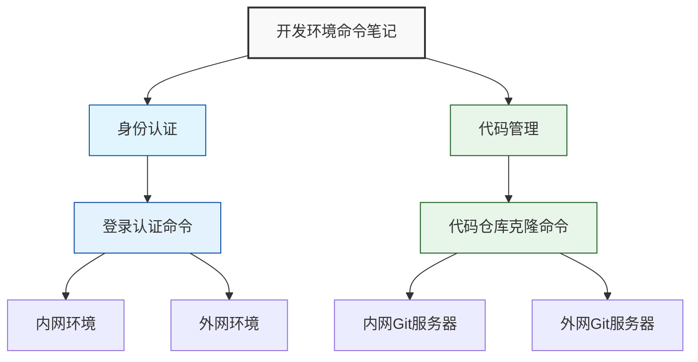
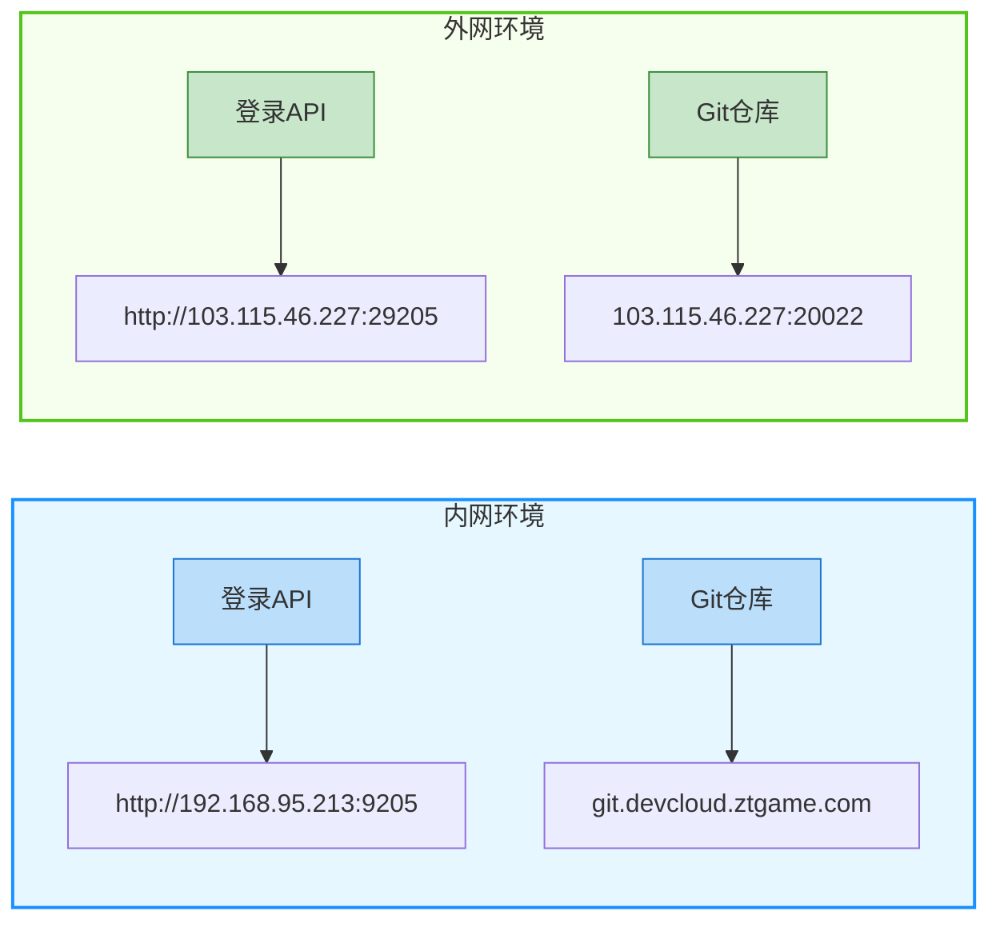
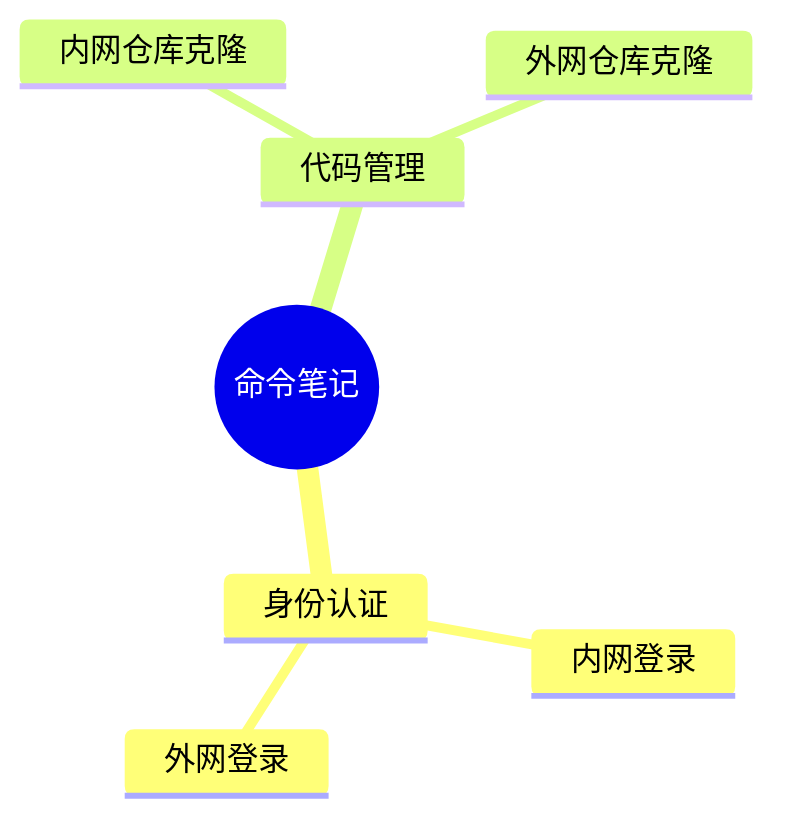
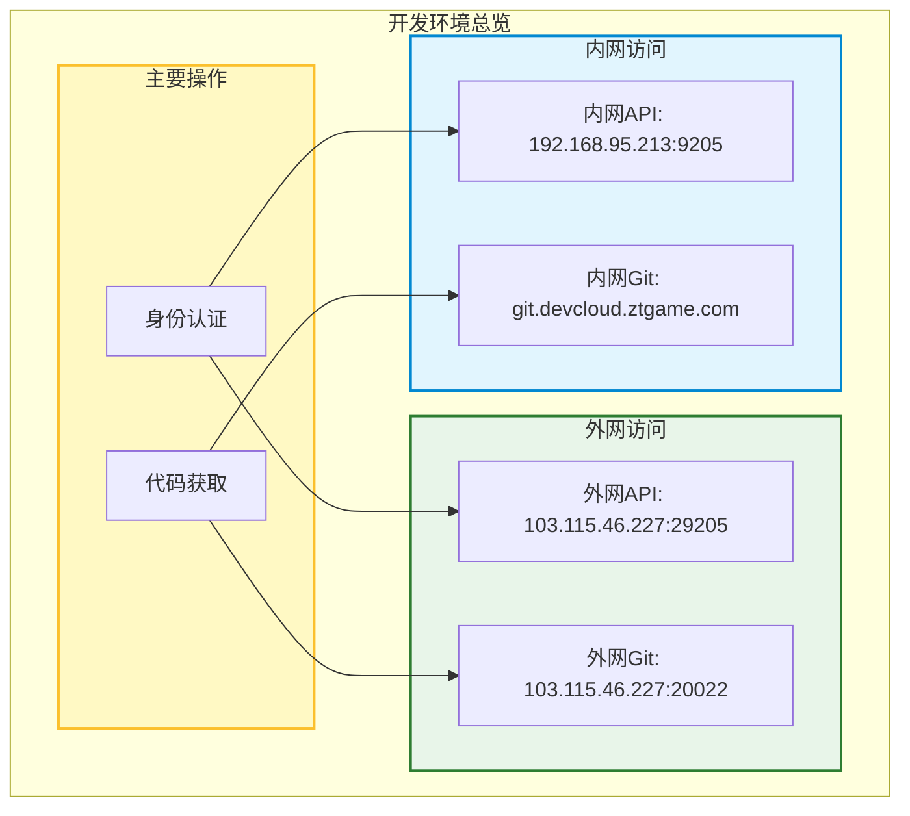

# 📝 开发环境命令笔记

## 目录

-   [📝 开发环境命令笔记](#-开发环境命令笔记)
    -   [🔑 1. 身份认证](#-1-身份认证)
        -   [1.1 登录认证命令](#11-登录认证命令)
    -   [📦 2. 代码管理](#-2-代码管理)
        -   [2.1 代码仓库克隆命令](#21-代码仓库克隆命令)
    -   [📊 3. 环境结构图解](#-3-环境结构图解)
        -   [3.1 命令关系图](#31-命令关系图)
        -   [3.2 网络环境对比](#32-网络环境对比)
        -   [3.3 命令类型树状图](#33-命令类型树状图)
        -   [3.4 开发环境总览](#34-开发环境总览)

## 🔑 1. 身份认证

### 1.1 登录认证命令

| 环境         | 命令                                                                                                                                                                                                                                                                                                                                                                                           |
| ------------ | ---------------------------------------------------------------------------------------------------------------------------------------------------------------------------------------------------------------------------------------------------------------------------------------------------------------------------------------------------------------------------------------------- |
| **内网环境** | `bash curl -X POST 'http://192.168.95.213:9205/auth/login' \   -H 'User-Agent: Mozilla/5.0 (Windows NT 10.0; Win64; x64) AppleWebKit/537.36 (KHTML, like Gecko) Chrome/131.0.0.0 Safari/537.36' \   -H 'Accept: application/json, text/plain, */*' \   -H 'Content-Type: application/json' \   -d '{"phone":"17621803113","password":"458e540a6057052681d188dfd3e9516a"}' `  |
| **外网环境** | `bash curl -X POST 'http://103.115.46.227:29205/auth/login' \   -H 'User-Agent: Mozilla/5.0 (Windows NT 10.0; Win64; x64) AppleWebKit/537.36 (KHTML, like Gecko) Chrome/131.0.0.0 Safari/537.36' \   -H 'Accept: application/json, text/plain, */*' \   -H 'Content-Type: application/json' \   -d '{"phone":"17621803113","password":"458e540a6057052681d188dfd3e9516a"}' ` |

## 📦 2. 代码管理

### 2.1 代码仓库克隆命令

| 环境                | 命令                                                                                                                  |
| ------------------- | --------------------------------------------------------------------------------------------------------------------- |
| **内网 Git 服务器** | `bash git clone -b feat-1.6.3-ytr git@git.devcloud.ztgame.com:ailab/se/ai-imagine/ai-imagine.git react_mojing ` |
| **外网 Git 服务器** | `bash git clone -b feat-1.6.3-ytr git@103.115.46.227:20022/se/ai-imagine/ai-imagine.git react_mojing `          |

## 📊 3. 环境结构图解

### 3.1 命令关系图

### 3.2 网络环境对比

### 3.3 命令类型树状图

### 3.4 开发环境总览

