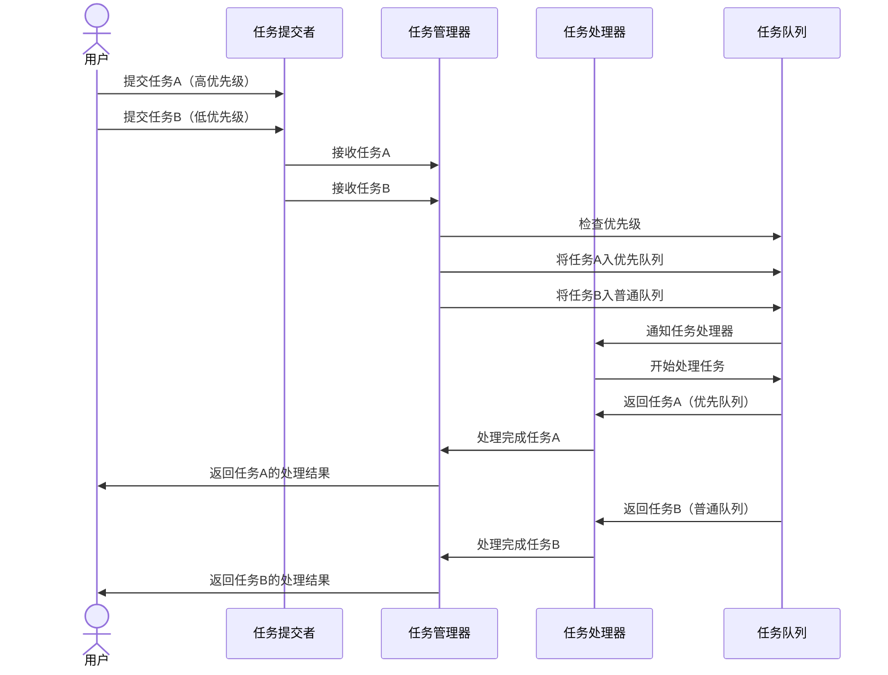

# YtrLogseq

我的个人知识管理仓库

基于Logseq的知识管理系统，用于记录、整理、归档、分享我的学习笔记、心得体会、知识总结等。

## 私密页面

public:: false

```mermaid
sequenceDiagram
    actor 用户
    participant 任务提交者
    participant 任务管理器
    participant 任务处理器
    participant 任务队列

    用户->>任务提交者: 提交任务A（高优先级）
    用户->>任务提交者: 提交任务B（低优先级）

    任务提交者->>任务管理器: 接收任务A
    任务提交者->>任务管理器: 接收任务B

    任务管理器->>任务队列: 检查优先级
    任务管理器->>任务队列: 将任务A入优先队列
    任务管理器->>任务队列: 将任务B入普通队列

    任务队列->>任务处理器: 通知任务处理器
    任务处理器->>任务队列: 开始处理任务
    任务队列->>任务处理器: 返回任务A（优先队列）

    任务处理器->>任务管理器: 处理完成任务A
    任务管理器->>用户: 返回任务A的处理结果

    任务队列->>任务处理器: 返回任务B（普通队列）

    任务处理器->>任务管理器: 处理完成任务B
    任务管理器->>用户: 返回任务B的处理结果
```