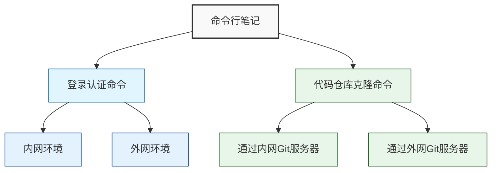

# 命令行笔记

## 1. 登录认证命令

### 内网环境

```bash
curl -X POST 'http://192.168.95.213:9205/auth/login' \
  -H 'User-Agent: Mozilla/5.0 (Windows NT 10.0; Win64; x64) AppleWebKit/537.36 (KHTML, like Gecko) Chrome/131.0.0.0 Safari/537.36' \
  -H 'Accept: application/json, text/plain, */*' \
  -H 'Content-Type: application/json' \
  -d '{"phone":"17621803113","password":"458e540a6057052681d188dfd3e9516a"}'
```

### 外网环境

```bash
curl -X POST 'http://103.115.46.227:29205/auth/login' \
  -H 'User-Agent: Mozilla/5.0 (Windows NT 10.0; Win64; x64) AppleWebKit/537.36 (KHTML, like Gecko) Chrome/131.0.0.0 Safari/537.36' \
  -H 'Accept: application/json, text/plain, */*' \
  -H 'Content-Type: application/json' \
  -d '{"phone":"17621803113","password":"458e540a6057052681d188dfd3e9516a"}'
```

## 2. 代码仓库克隆命令

### 通过内网 Git 服务器

```bash
git clone -b feat-1.6.3-ytr git@git.devcloud.ztgame.com:ailab/se/ai-imagine/ai-imagine.git react_mojing
```

### 通过外网 Git 服务器

```bash
git clone -b feat-1.6.3-ytr git@103.115.46.227:20022/se/ai-imagine/ai-imagine.git react_mojing
```

## 命令结构图解


