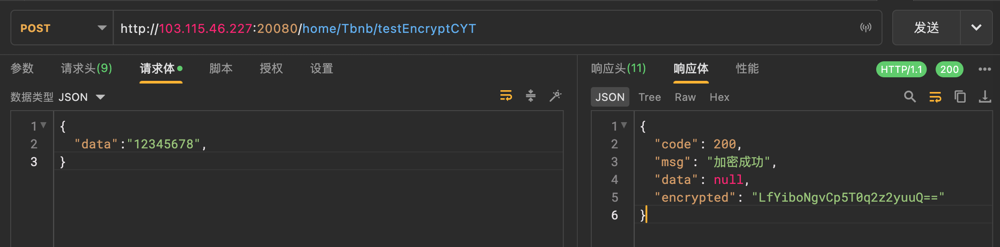
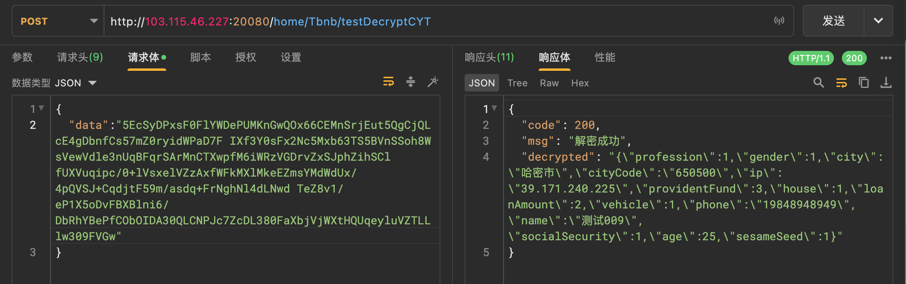
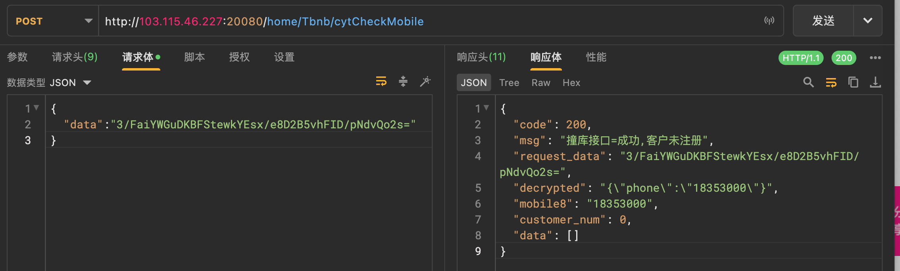
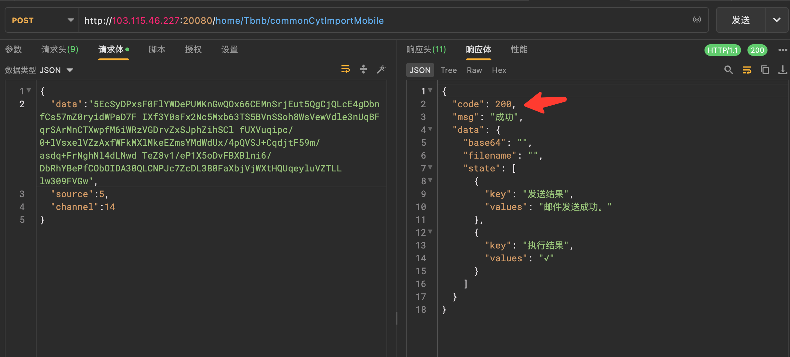
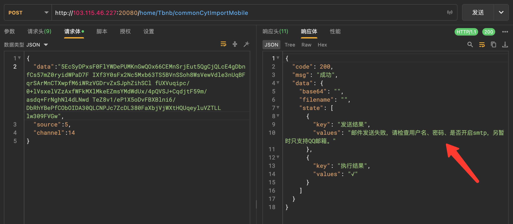
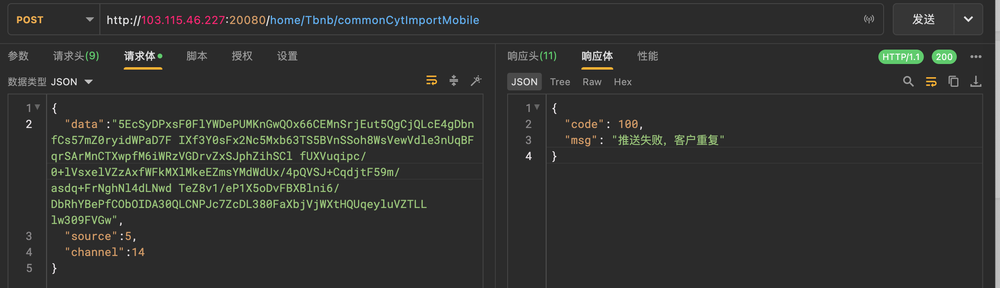

public:: true

- ## 0-基础说明
	- 请求的baseUrl
		- http://123.56.47.177:20080
	- 请求方式
		- post方式 (application/json;charset=utf-8)
	- AES加解密说明
		- 在线工具
			- [在线AES加密解密、AES在线加密解密、AES encryption and decryption--查错网](http://tool.chacuo.net/cryptaes )
		- 加密说明
		  collapsed:: true
			- 参数可见此函数
			  collapsed:: true
				- ```php
				      function encryptAES($data)
				      {
				          // 密钥
				          $key = 'hbt4j8ql7n7yjtfb';
				          // 加密算法
				          $method = 'AES-128-ECB';
				  
				          // 加密数据
				          $encrypted = openssl_encrypt($data, $method, $key, OPENSSL_RAW_DATA);
				  
				          // 检查加密是否成功
				          if ($encrypted === false) {
				              return null; // 或者处理错误
				          }
				  
				          // 返回base64编码的加密数据，以便于存储或传输
				          return base64_encode($encrypted);
				          // return $encrypted;
				      }
				  ```
			- 测试用接口
			  collapsed:: true
				- crul
					- ```shell
					  curl -X POST 'http://103.115.46.227:20080/home/Tbnb/testEncryptCYT' -H 'Content-Type: application/json' -H 'Cookie: _bess=b22edbff702750f; s68113b96=d58930349ec322630b5fc2bedfb9f5f5' -d '{
					    "data":"12345678",
					  }'
					  ```
				- 截图
				  collapsed:: true
					- 
		- 解密说明
		  collapsed:: true
			- 参数可见此函数
			  collapsed:: true
				- ```php
				  function decryptAES($encryptedData)
				      {
				          // 密钥
				          $key = 'hbt4j8ql7n7yjtfb';
				          // 解密算法
				          $method = 'AES-128-ECB';
				  
				          // 对数据进行base64解码
				          $data = base64_decode($encryptedData);
				  
				          // 解密数据
				          $decrypted = openssl_decrypt($data, $method, $key, OPENSSL_RAW_DATA);
				  
				          // 检查解密是否成功
				          if ($decrypted === false) {
				              return null; // 或者处理错误
				          }
				  
				          // 返回解密后的数据
				          return $decrypted;
				      }
				  ```
			- 测试用接口
			  collapsed:: true
				- crul
					- ```shell
					  curl -X POST 'http://103.115.46.227:20080/home/Tbnb/testDecryptCYT' -H 'Content-Type: application/json' -H 'Cookie: _bess=b22edbff702750f; s68113b96=d58930349ec322630b5fc2bedfb9f5f5' -d '{
					    "data":"5EcSyDPxsF0FlYWDePUMKnGwQOx66CEMnSrjEut5QgCjQLcE4gDbnfCs57mZ0ryidWPaD7F IXf3Y0sFx2Nc5Mxb63TS5BVnSSoh8WsVewVdle3nUqBFqrSArMnCTXwpfM6iWRzVGDrvZxSJphZihSCl fUXVuqipc/0+lVsxelVZzAxfWFkMXlMkeEZmsYMdWdUx/4pQVSJ+CqdjtF59m/asdq+FrNghNl4dLNwd TeZ8v1/eP1X5oDvFBXBlni6/DbRhYBePfCObOIDA30QLCNPJc7ZcDL380FaXbjVjWXtHQUqeyluVZTLL lw309FVGw"
					  }'
					  ```
				- 截图
					- 
- ## 1-撞库接口
	- /home/Tbnb/cytCheckMobile
		- 测试数据
		- case1=找到了数据 data=String[],里面的元素是手机号前8位的md5
		  collapsed:: true
			- ydq/479Nq5x+oA9rdjCymf0MUmSJNoS0AH5fRdR9P0w=
				- 数据可能失效,仅供演示说明返回结构
				- 会返回2个md5
				- 
		- case2=找不到数据 data=[]
		  collapsed:: true
			- curl
				- ```
				  curl -X POST 'http://103.115.46.227:20080/home/Tbnb/cytCheckMobile' -H 'Content-Type: application/json' -H 'Cookie: _bess=b22edbff702750f; s68113b96=d58930349ec322630b5fc2bedfb9f5f5' -d '{
				    "data":"3/FaiYWGuDKBFStewkYEsx/e8D2B5vhFID/pNdvQo2s="
				  }'
				  ```
			- 截图
				- 
	-
	-
	- Apifox截图 (仅供参考,以实际请求host为准,截图的host只是示例)
	  collapsed:: true
		- {:height 390, :width 591}
			-
- ## 2-进件接口
	- /home/Tbnb/commonCytImportMobile
		- ### CURL
			- ```
			  curl -X POST 'http://103.115.46.227:20080/home/Tbnb/commonCytImportMobile' -H 'Content-Type: application/json' -d '{
			    "data":"5EcSyDPxsF0FlYWDePUMKnGwQOx66CEMnSrjEut5QgCjQLcE4gDbnfCs57mZ0ryidWPaD7F IXf3Y0sFx2Nc5Mxb63TS5BVnSSoh8WsVewVdle3nUqBFqrSArMnCTXwpfM6iWRzVGDrvZxSJphZihSCl fUXVuqipc/0+lVsxelVZzAxfWFkMXlMkeEZmsYMdWdUx/4pQVSJ+CqdjtF59m/asdq+FrNghNl4dLNwd TeZ8v1/eP1X5oDvFBXBlni6/DbRhYBePfCObOIDA30QLCNPJc7ZcDL380FaXbjVjWXtHQUqeyluVZTLL lw309FVGw",
			    "source":5,
			    "channel":14
			  }'
			  ```
		- ### 请求参数
			- data AES加密的数据
			- source 5 表示cyt 提供数据的服务商
			- channel 14 表示接收数据的公司
	- Apifox截图 (仅供参考,以实际请求host为准,截图的host只是示例)
		- ### 成功示例
			- 
			- 在员工未配置邮箱时,依然是200 成功,不过data里面会提示发送邮件提醒失败
				- 
		- ### 失败示例
			- 重复执行时会返回code=100 msg=客户重复
			- 
		-
			-
			-